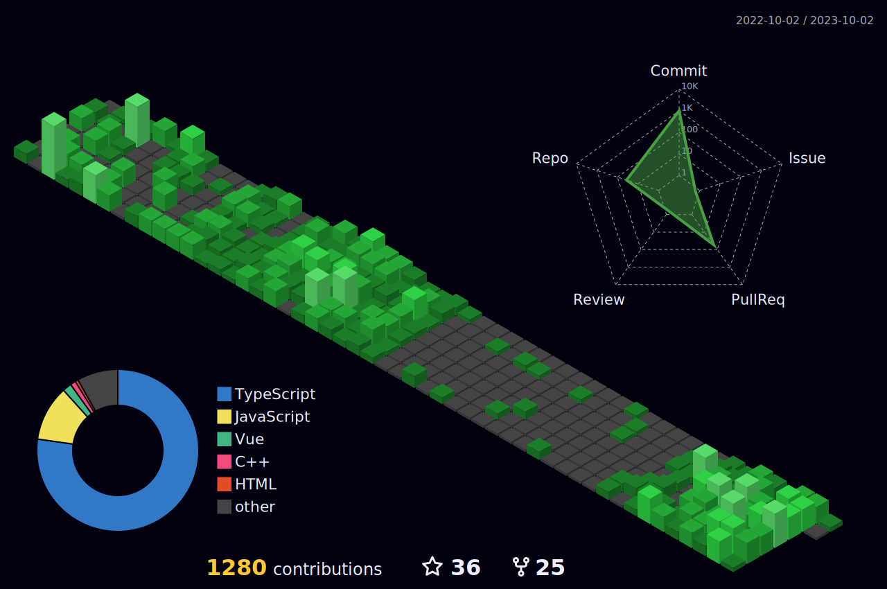

  <h1 align="center">Hello World 🌍   Hi 👏🏽, I'm Matheus Balestreiro</h1>
  <h3 align="center">Desenvolvedor Front-end  React.js | Next.js | Typescript | Tailwindcss</h3>

  

<h2 align="center">🚀 Tecnologias</h2>

  

<h2 align="center">📫 Contato</h2>

 
   
   
   

 

  
  
 |  |  |  
 | ----------- | ----------- |

  

 

